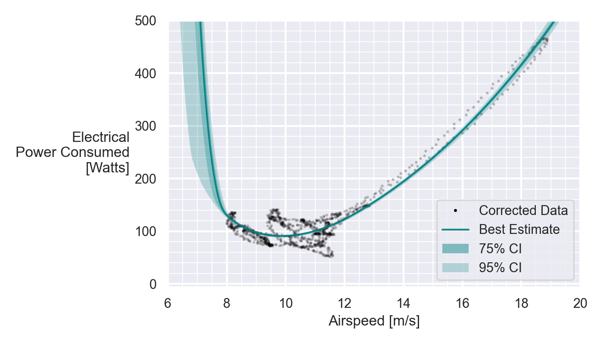
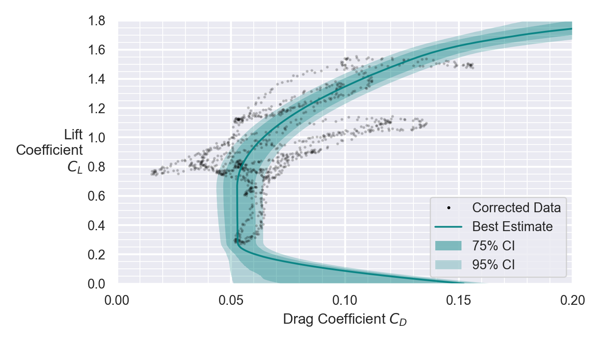

# Aircraft Polar Reconstruction from Minimal Flight Test Data

by Peter Sharpe

This repository contains the code used to generate the results in the paper "Physics-Informed Regression and Uncertainty Quantification of Aircraft Performance from Minimal Flight Data", with full citation here:

```bibtex
@inproceedings{sharpe2024physics,
  title={Physics-Informed Regression and Uncertainty Quantification of Aircraft Performance from Minimal Flight Data},
  author={Peter Sharpe and R. John Hansman},
  booktitle={AIAA SciTech 2024},
  year={2024}
}
```

[A summary of the problem we're solving and key results is in this presentation](./presentation/Physics-Informed%20Regression%20of%20Aircraft%20Performance%20from%20Minimal%20Flight%20Data.pptx).

[The paper PDF is available here](./out/main.pdf).

## Problem Statement

A common task in initial flight testing of aircraft is validating key performance curves that characterize how the aircraft functions under different conditions. Three major curves need to be determined: the power curve relating velocity to required power; the aerodynamic polar showing the aircraft's drag coefficient as a function of lift coefficient; and the propulsive efficiency curve delineating efficiency as a function of advance ratio.

The standard procedure for mapping these curves is known as "sweeping and averaging." It involves trimming the aircraft at each test condition by adjusting power, pitch angle, and airspeed. The aircraft must be held at each trimmed condition long enough to account for phugoid damping and to average out variability from wind gusts. This entire sweep of conditions needs to be repeated multiple times to map out the full performance curve.

This standard sweeping and averaging methodology is extremely data- and labor-intensive, requiring a costly amount of flight test time. The large number of condition sets to map and long duration sampling at each set combine to make the initial flight test campaign highly demanding in resources. New methods that can reduce the flight time requirements would therefore be very useful in improving efficiency.

## Methodology


## Case Study

MIT 16.821 Solar-Electric Airplane (4-meter wingspan, 9.5 kg TOGW).


Original three-view (some discrepancies from as-built aircraft, but serves to illustrate concept).


## Main Case Study Results






## Other Results

The paper develops some methods for estimating noise variance of a signal directly from the noisy signal itself, under certain assumptions. This is useful for estimating the uncertainty of the reconstructed curves. See [the paper](./out/main.pdf) for more details.